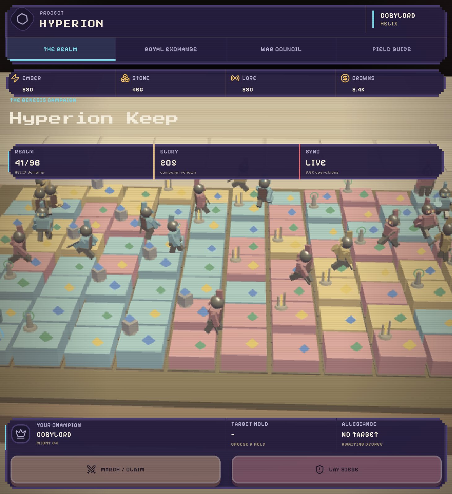
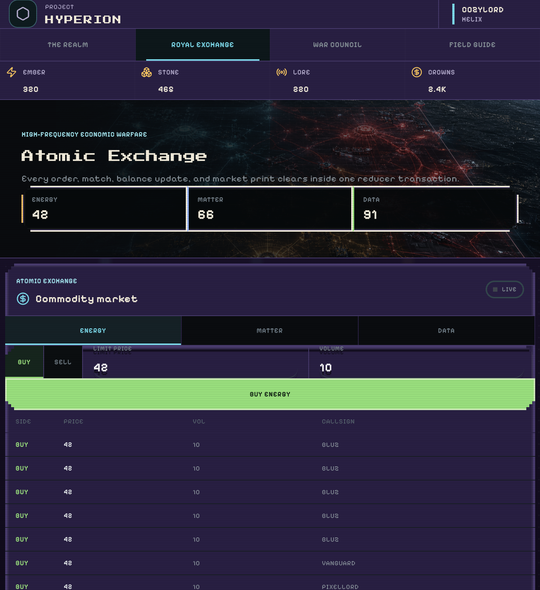
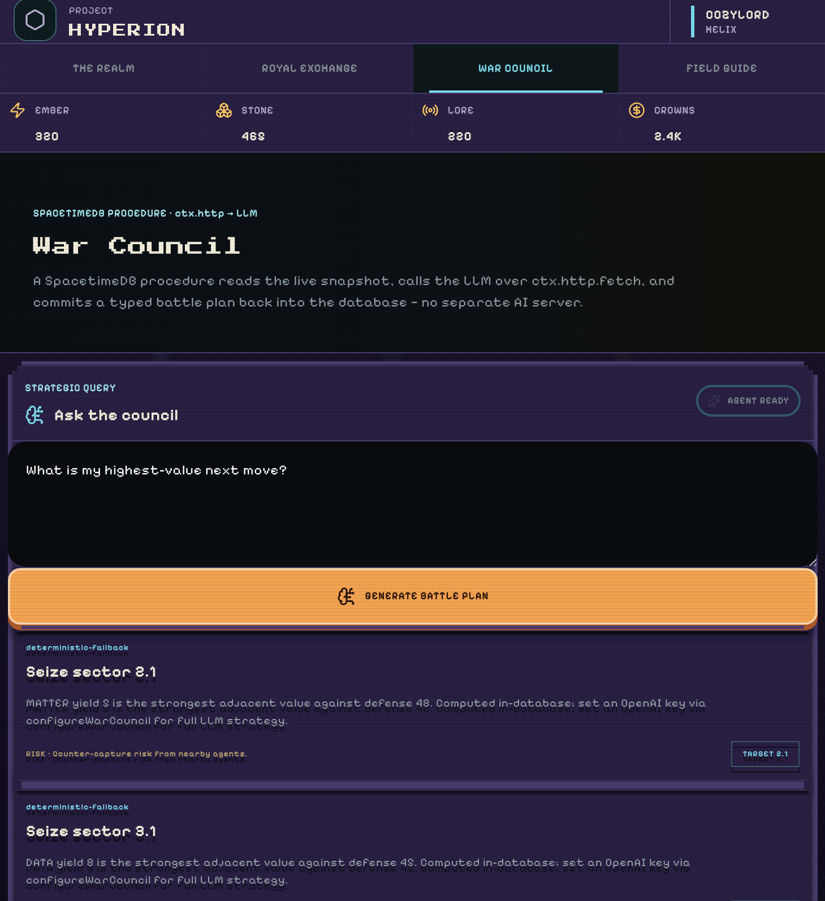
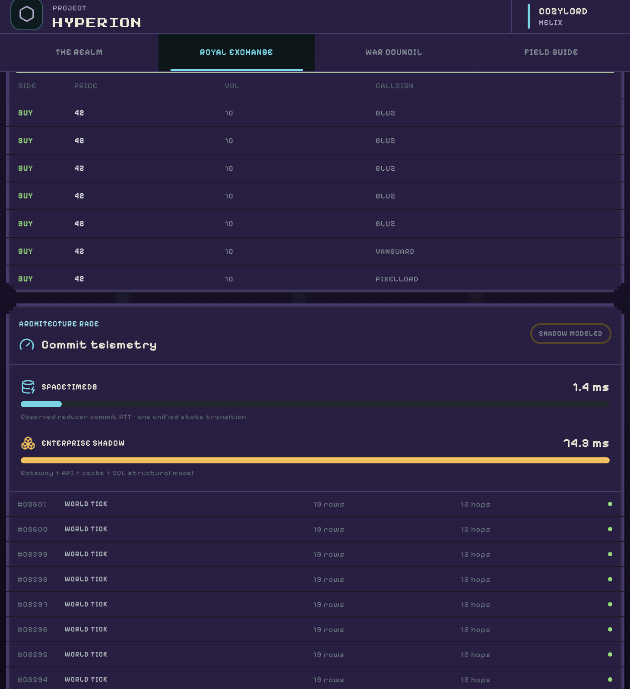
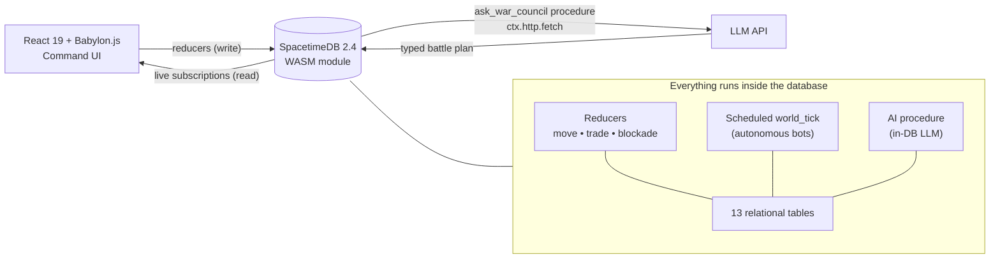

<div align="center">

# ⚔️ PROJECT HYPERION
### _A Living Benchmark Arena, powered entirely by SpacetimeDB_

**No API server. No game server. No backend.**
The database _is_ the server — movement, an atomic commodity exchange, and an in‑database AI strategist all run inside one WebAssembly module.

`SpacetimeDB 2.4` · `React 19` · `Babylon.js` · `TypeScript` · `In‑DB LLM Procedure`



</div>

---

## ▶ Press Start

Hyperion is a real‑time, multiplayer strategy game **and** a live performance benchmark. Human commanders and autonomous bot agents fight over a shared sector grid, clear limit orders on an atomic exchange, and consult an AI war council — while every single action commits as **one database transaction** and streams back to every client in real time.

The twist: there is no traditional stack behind it. In most multiplayer games you'd wire up a gateway, an API server, a cache, and a SQL database. Hyperion collapses all of that into **SpacetimeDB** — a relational database that runs your application logic (as WebAssembly "reducers") right next to your data. The React client talks to it directly over a WebSocket and renders live database rows.

> **The pitch in one line:** _Same game a “real” company would build with five services — running on one database, and we show you exactly how much faster that is._

---

## 🗺️ The Four Wings

The arena has four screens. Here's what each one does and why it matters.

### 🏰 The Realm — _the battlefield_
A fully interactive **Babylon.js** war table. Every tile is a `grid_node` row; every little knight is a `unit` row owned by a commander. Pick an adjacent sector and **March / Claim** — that fires a transactional `move_unit` reducer that validates the move, flips the tile's controller, and broadcasts the change to everyone. Bots run the exact same reducers you do, so the whole board is alive.

> Units have full state‑based animation: idle breathing & glances, a bouncy walk, and a sword‑raising **capture celebration** with a victory spin for your own commander.

### 💹 Royal Exchange — _the market_


A real‑time commodity market for **Energy / Matter / Data**. Placing an order fires a single `place_order` reducer that does _everything_ atomically: books the order, matches it against the order book with price‑time priority, updates balances, and prints the trade. There is no race condition to defend against — **the database is the matching engine**.

### 🧠 War Council — _AI that lives in the database_


This is the centerpiece. The War Council is an **LLM strategist that runs _inside_ SpacetimeDB as a procedure**. The `ask_war_council` procedure snapshots live game state, calls an LLM over `ctx.http.fetch`, validates the structured plan, and commits the recommendation back into the `war_counsel` table — entirely server‑side. No separate AI microservice. If no API key is configured, it transparently falls back to deterministic tactical analysis, so the demo never breaks.

### 📊 Field Guide & the Benchmark — _the proof_


Every world tick logs telemetry. The "Architecture Race" puts Hyperion's observed reducer commit time (~1 ms) next to a clearly **`MODELED`** enterprise baseline (gateway + API + cache + SQL, tens of ms). Same workflow, a fraction of the moving parts.

> **Integrity note:** the SpacetimeDB number is client‑observed commit RTT; the enterprise figure is explicitly labeled a structural model, never presented as a measured fact.

---

## 🎮 The Gameplay Loop

| Step | Action | Behind the scenes |
| ---- | ------ | ----------------- |
| 1 | **Enlist** — choose a faction, spawn your commander | `join_arena` reducer |
| 2 | **March** onto a neighboring sector to claim it | `move_unit` reducer |
| 3 | **Lay Siege** — blockade a contested hold | `deploy_blockade` reducer |
| 4 | **Trade** Energy / Matter / Data to fund your war | `place_order` / `cancel_order` reducers |
| 5 | **Consult** the AI War Council for your best next move | `ask_war_council` procedure → `war_counsel` |
| 6 | **Watch** bots, prices, and the board update live | scheduled `world_tick` + subscriptions |

**Factions:** `HELIX` · `NOVA` · `VOID`  **Resources:** `ENERGY` · `MATTER` · `DATA`  **Grid:** 96 sectors

---

## 🏗️ Architecture



There is **no Node server, no Postgres, and no cache** in the running app. The client is a static bundle; SpacetimeDB hosts both the data and the logic.

### Tech stack
- **Backend / DB:** SpacetimeDB 2.4 (TypeScript module → WebAssembly)
- **Frontend:** React 19 + Vite + TypeScript
- **3D:** Babylon.js (procedural low‑poly board + animated characters)
- **AI:** In‑database SpacetimeDB **procedure** using `ctx.http.fetch` (+ deterministic fallback)
- **Realtime:** Generated typed bindings + `spacetimedb/react` subscriptions

---

## 🗃️ Inside the Module

**13 tables** model the whole world by access pattern:

`player` · `grid_node` · `unit` · `bot_agent` · `agent_intent` · `war_counsel` · `ai_config` · `order_book` · `trade` · `blockade` · `telemetry_log` · `arena_state` · `world_timer`

**Reducers & procedure** (all logic is transactional and deterministic):

| Name | Kind | Purpose |
| ---- | ---- | ------- |
| `join_arena` | reducer | Enlist a commander, pick a faction, spawn a unit |
| `move_unit` | reducer | March/claim an adjacent sector |
| `deploy_blockade` | reducer | Lay siege to a sector |
| `place_order` / `cancel_order` | reducer | Atomic market: book, match, settle, refund |
| `configure_war_council` | reducer | Owner stores the LLM key/model in `ai_config` |
| `ask_war_council` | **procedure** | Snapshot state → call LLM via `ctx.http.fetch` → commit plan |
| `record_war_counsel` | reducer | Persist a battle plan to `war_counsel` |
| `world_tick` | scheduled | Drives autonomous bot agents + telemetry |

---

## 🚀 Run It Locally

**Prerequisites:** Node.js 20+, npm, and the [SpacetimeDB CLI](https://spacetimedb.com/install) 2.4+.

```bash
# 1. install module + client deps
npm run install:all

# 2. start a local SpacetimeDB instance (keep this running)
npm run dev:database
```

In a second terminal:

```bash
# 3. publish the module locally + generate typed client bindings
npm run publish:local
npm run generate

# 4. start the client
npm run dev:client
```

Open **http://127.0.0.1:5173** and enlist. 🎉

**(Optional) Real LLM strategist** — the key lives _inside_ the database, never in the client:

```bash
spacetime call hyperion-popxo configure_war_council '"sk-your-openai-key"' '"gpt-4o-mini"'
```

Skip it and the War Council uses its deterministic fallback automatically.

---

## ☁️ Deploy (SpacetimeDB Maincloud + Vercel)

SpacetimeDB Maincloud hosts the database **and** the logic. Vercel only serves the static client. **There is no `DATABASE_URL` and no DB env var to set on Vercel.**

**1. Publish the module to Maincloud**
```bash
spacetime login
npm run publish:maincloud   # publishes the "hyperion-popxo" module
npm run generate
```

**2. Import the repo into Vercel** with these settings:

| Setting | Value |
| ------- | ----- |
| Root Directory | `client` |
| Framework Preset | `Vite` |
| Build Command | `npm run build` |
| Output Directory | `dist` |

**3. Set the only two environment variables** (Vercel → Settings → Environment Variables):

| Name | Value |
| ---- | ----- |
| `VITE_SPACETIMEDB_URI` | `wss://maincloud.spacetimedb.com` |
| `VITE_SPACETIMEDB_DATABASE` | `hyperion-popxo` |

These are read in `client/src/main.tsx`, baked in at build time (they're public — just an endpoint + a database name). Your LLM secret stays inside the module via `configure_war_council`. **Redeploy after changing env vars.**

---

## 📁 Project Layout

```
hyperion/
├── spacetimedb/        # the WASM module — schema, reducers, AI procedure, scheduled bots
│   └── src/index.ts
├── client/             # React 19 + Vite + Babylon.js command UI
│   ├── src/            #   app, components, and generated module_bindings
│   └── public/         #   command-core background art + icons
├── screenshots/        # images used in this README
└── package.json        # one-command dev/build/publish orchestration
```

---

## ✅ Why It Wins

- **One database does it all** — game logic, a real matching engine, autonomous agents, and an LLM, with zero backend services.
- **Genuinely real‑time & multiplayer** — humans and bots share state through live subscriptions.
- **AI where your data is** — the LLM strategist is a database procedure, not a bolted‑on service.
- **Honest, visible benchmark** — speed isn't claimed, it's shown, with the comparison clearly labeled as modeled.
- **Polished & deployable** — cohesive cozy‑pixel indie art, animated characters, and a one‑click Vercel + Maincloud path to a live URL.

<div align="center">

_Built on **SpacetimeDB** — the database that is also your server._

</div>
